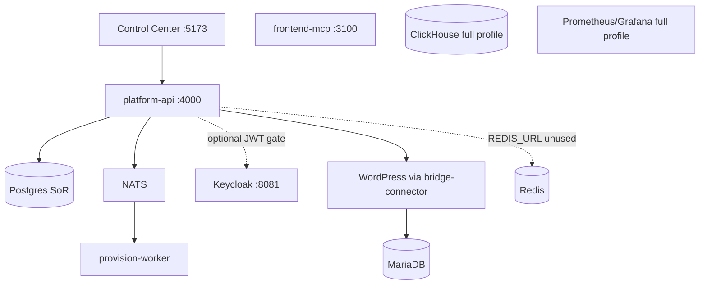

# 02 — Current Architecture (Brownfield As-Built)

## Authority model (actual)

| Concern | Authority | Status |
|---------|-----------|--------|
| Tenants, apps, billing, audit, sagas | PostgreSQL via `platform-api` | SoR — PASS (schema + API) |
| Identity tokens | Keycloak realm import | Present; enforcement optional — PARTIAL |
| Tenant membership resolution from JWT | Not implemented | FAIL |
| WordPress content runtime | MariaDB + WP + `bridge-connector` | Tenant app — PARTIAL |
| Cache/session | Redis container | Running substrate; **unused by API** — FAIL |
| Events | NATS JetStream subjects | Provision path — PARTIAL |
| Analytics | ClickHouse (profile `full`) | Schema only; no writers — UNVERIFIED |

## Runtime topology

## Request context (actual)

- Default identity: headers `x-actor-id`, `x-actor-roles`, `x-actor-email`.
- When `BRIDGE_REQUIRE_JWT=1`: requires `Authorization: Bearer …` but **does not** validate signature/JWKS; sets `unverifiedJwt: true`.
- Tenant scope: `x-tenant-id` (or query) required for tenant-bound ops via `requireTenant`.

## Composition root

- `docker-compose.yml`: postgres (+001/002), redis, nats, keycloak, api, provision-worker, frontend-mcp, control-center, wordpress-db, wordpress; optional clickhouse/prometheus/grafana (`full` profile).
- Seed tenant: `bridge-demo` with WordPress, React, AI Hub, Online Store apps.

## Gaps vs diagram aspirational claims

Redis and ClickHouse appear in Compose/README but are **not** integrated in application code (grep: no Redis/ClickHouse clients under `services/`).
