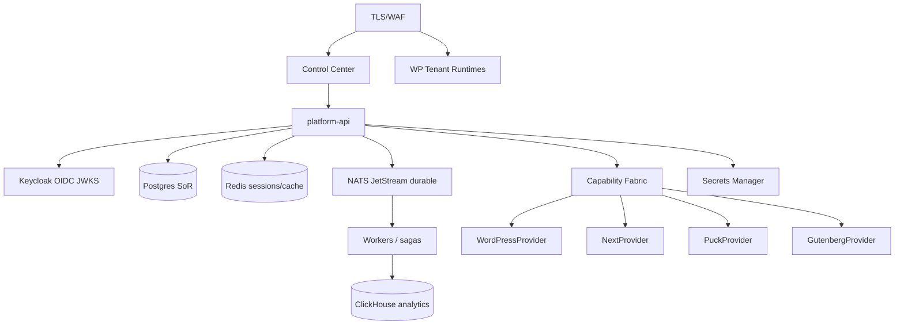

# 14 — Target Architecture

## End-state (intended)

## Non-negotiables

1. Postgres + platform-api remain SoR for tenancy and control plane.
2. WordPress never becomes tenancy authority.
3. Mutations go Actor → Tenant → Entitlement → RBAC → Capability → Provider → Audit.
4. External providers fail closed.
5. JWT validated via JWKS before trusting roles.

## Near-term build order

| Priority | Item | Exit criteria |
|----------|------|---------------|
| P0 | jose/JWKS + disable header roles when JWT on | Integration test vs Keycloak |
| P0 | CI: unit + Test-Bridge smoke | Green workflow artifact |
| P1 | Outbox relay + consumer idempotency | No dual-publish races |
| P1 | Redis session/rate-limit usage | Documented keys + metrics |
| P2 | ClickHouse writers from audit/events | Rows appear under load |
| P2 | Puck/Gutenberg providers MVP | Capability publish path |
| P3 | ZIP import pipeline | Import → draft changeset |
| P3 | SQL Server/Mongo live providers | Or remove from READY paths |

## What already matches target

Modular API, schema expansion, capability seed, website provider abstraction, provision saga skeleton, command-center metrics, connector boundary.

## Verdict

Target is clear; current state is **PARTIAL** toward it. Do not claim arrival until E2E + JWT evidence exist.
