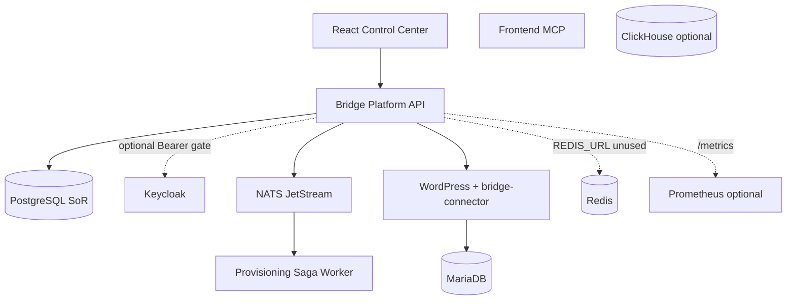

# Architecture (As-Built)

Branch: `bridge-ecosystem-platform` · Verdict context: **PARTIALLY TRANSFORMED**

## Authority

| Plane | Authority | Notes |
|-------|-----------|-------|
| Control plane SoR | PostgreSQL + `platform-api` | Tenants, apps, billing, CMS metadata, capabilities, workflows, agents, audit, sagas |
| Identity | Keycloak (Compose) | JWT enforcement **optional** via `BRIDGE_REQUIRE_JWT`; **no full JWKS validation yet** |
| Tenant app runtime | WordPress + MariaDB via `bridge-connector` | Not tenancy authority |
| Cache | Redis (Compose) | Substrate present; **not used by API code** |
| Events | NATS JetStream | Provision request/complete/fail subjects |
| Analytics | ClickHouse (`full` profile) | DDL only; **no writers** |

## Tenancy

- Business rows are tenant-owned in Postgres (`isolation_mode` default `SHARED`).
- Tenant-bound API operations require `x-tenant-id` (see `requireTenant`).
- Default lab identity uses `x-actor-*` headers; production must resolve membership from validated claims (not implemented).

## Capability path

Intended: Actor → Tenant → Entitlement → RBAC → Capability → Provider → Audit (`lib/capabilities.js`).  
Legacy routes (resources/affiliates) still call RBAC/SQL directly.

## Events / provisioning

Provisioning inserts `sagas` + `outbox` and publishes `provision.requested`. Worker runs steps: validate → allocate DB → register app → bind domain → verify health → complete, recording `saga_steps`. Production still needs transactional outbox relay and consumer idempotency.

## Implemented expansion (post-baseline)

- Schema `infra/postgres/002-platform-expansion.sql`
- Modular API: `lib/kernel.js`, `lib/rbac.js`, `lib/capabilities.js`, `providers/website.js`, `routes/domains.js`
- Billing idempotency, CMS/brand, databases control plane, workflows, agents/changesets (multi-site phone-change), command-center metrics
- Scripts: Test / Backup / Restore; unit tests under `services/platform-api/test/`

## Known gaps

Full OIDC JWKS; Puck/Gutenberg deep builders; ZIP import; Redis/ClickHouse app integration; SQL Server/Mongo live providers (**UNVERIFIED**); TLS/secrets manager; CI workflows; golden-path E2E may be **UNVERIFIED** if Docker is unavailable or hangs.

## ADRs

See `docs/adr/` for decision records (isolation, identity, capabilities, NATS, Postgres, WordPress MySQL, Redis, ClickHouse, Gutenberg, Puck, providers, AI approval, workflow durability, provisioning saga, secrets, observability).
