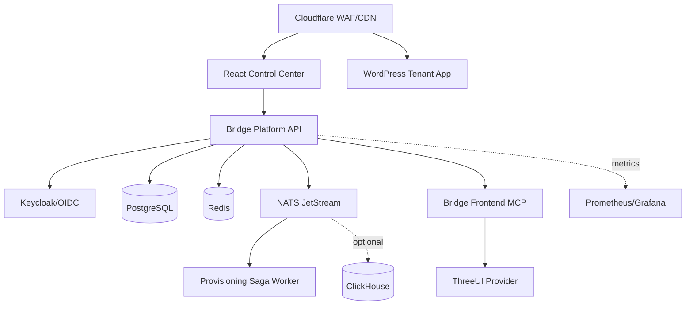

# Architecture

## Tenancy

All business records are tenant-owned. The local v1 API requires explicit `x-tenant-id` on tenant-bound operations. Production identity integration should resolve tenant membership from authenticated claims and enforce it server-side.

## Events

Provisioning requests are persisted to `outbox` and published to NATS. The worker advances saga state and emits completion/failure events. Production should add an outbox relay transaction and consumer idempotency table.
