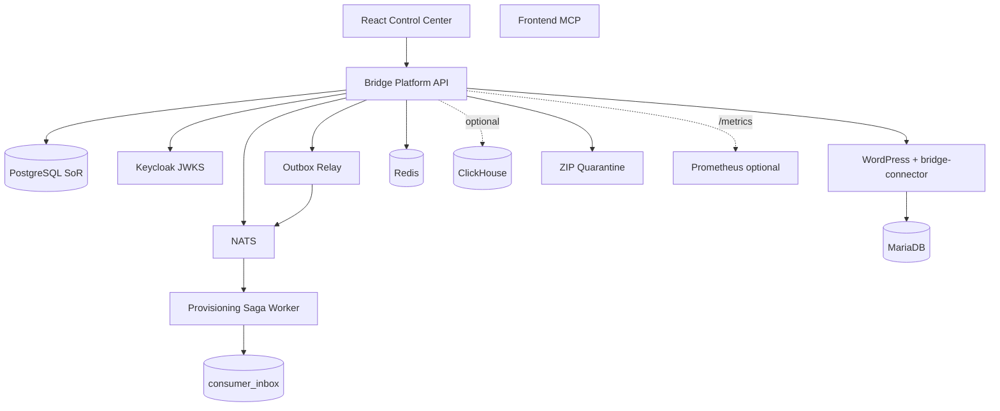

# Architecture (As-Built)

Branch: `bridge-ecosystem-platform` · Verdict context: **GAP CLOSURES LANDED** (lab-complete; external KMS/TLS still production hardening)

## Authority

| Plane | Authority | Notes |
|-------|-----------|-------|
| Control plane SoR | PostgreSQL + `platform-api` | Tenants, apps, billing, CMS metadata, capabilities, workflows, agents, audit, sagas |
| Identity | Keycloak (Compose) | jose JWKS validation when Bearer present / `BRIDGE_REQUIRE_JWT=1`; lab headers when trusted |
| Tenant app runtime | WordPress + MariaDB via `bridge-connector` | Not tenancy authority |
| Cache | Redis (Compose) | Rate-limit + command-center cache |
| Events | NATS + outbox relay | `provision.requested` via outbox; worker `consumer_inbox` idempotency |
| Analytics | ClickHouse (`full` + `CLICKHOUSE_URL`) | Soft-fail writers from audit + outbox |

## Tenancy

- Business rows are tenant-owned in Postgres (`isolation_mode` default `SHARED`).
- Tenant-bound API operations require `x-tenant-id` (see `requireTenant`).
- Lab identity may use `x-actor-*` headers; production/JWT mode resolves membership from validated claims.

## Capability path

Intended: Actor → Tenant → Entitlement → RBAC → Capability → Provider → Audit (`lib/capabilities.js`).  
Legacy routes (resources/affiliates) still call RBAC/SQL directly.

## Events / provisioning

Provisioning inserts `sagas` + `outbox` only. Outbox relay publishes `provision.requested`. Worker runs steps: validate → allocate DB → register app → bind domain → verify health → complete, recording `saga_steps`, with `consumer_inbox` dedupe.

## Builders / imports

- Puck: schema + `puck_pages` documents
- Gutenberg: Site Editor deep links
- ZIP: quarantine + malware adapter + explicit release

## Implemented expansion

- Schema `infra/postgres/002-platform-expansion.sql` + `003-gap-closures.sql`
- Modular API: kernel, auth (jose), redis, clickhouse, outbox, secrets, zip-import, builders
- Billing idempotency, CMS/brand, databases, workflows, agents/changesets
- Scripts: Test / Backup / Restore; unit tests under `services/platform-api/test/`
- CI: unit + worker syntax + PHP lint + `docker compose config`

## Remaining production hardening

External KMS/secrets manager; TLS termination; JetStream durable consumers; full OIDC login UX in Control Center; SQL Server/Mongo live engines (**UNVERIFIED** without local infra); golden-path E2E when Docker available.

## ADRs

See `docs/adr/` (isolation, identity, capabilities, NATS, Postgres, WordPress MySQL, Redis, ClickHouse, Gutenberg, Puck, providers, AI approval, workflow durability, provisioning saga, secrets, observability, ZIP quarantine).
